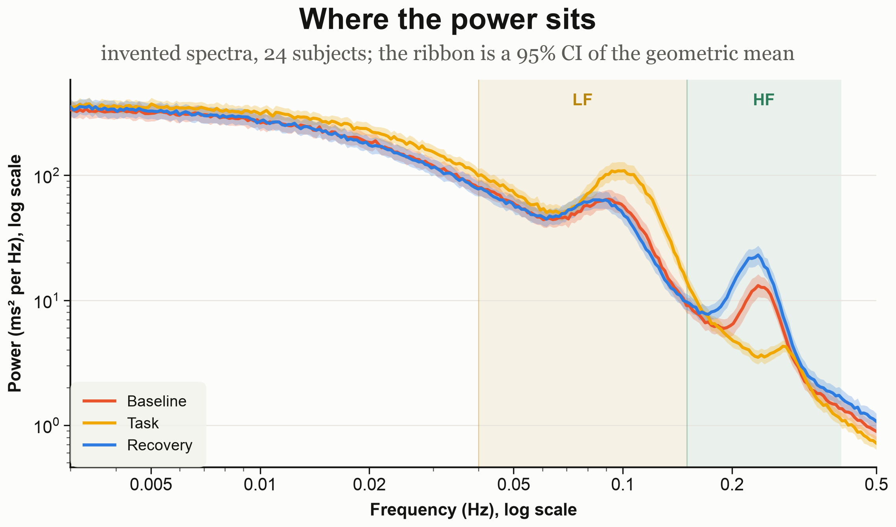
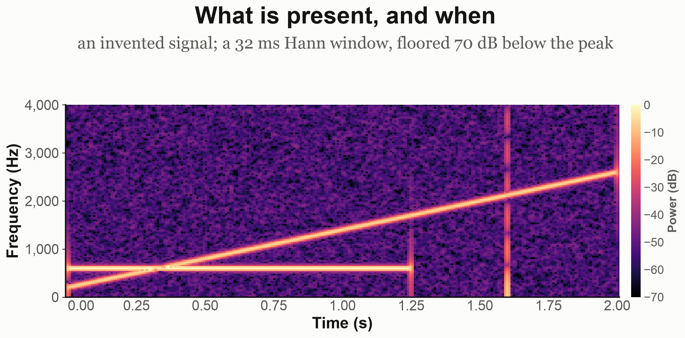
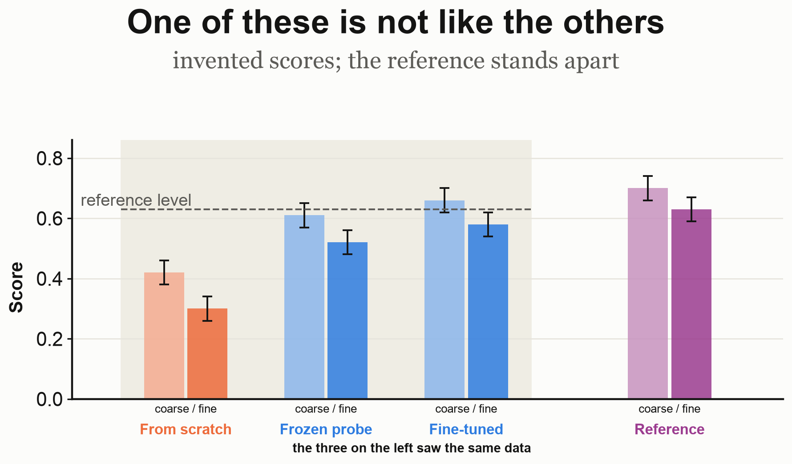
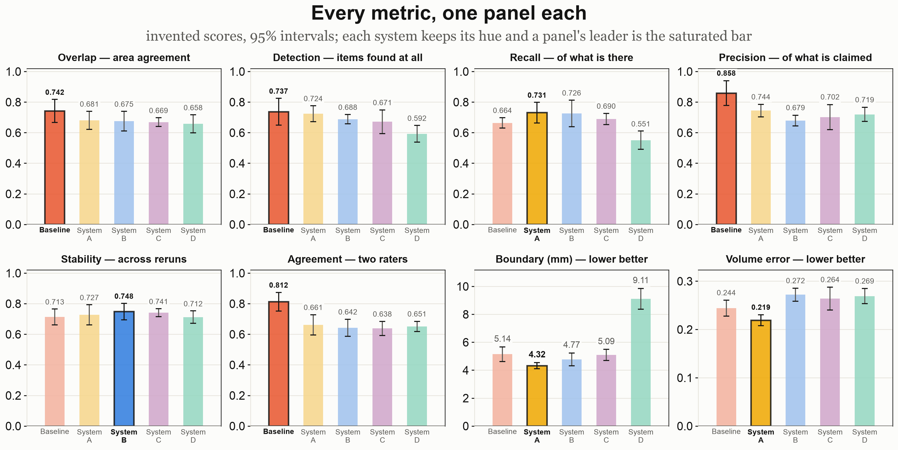
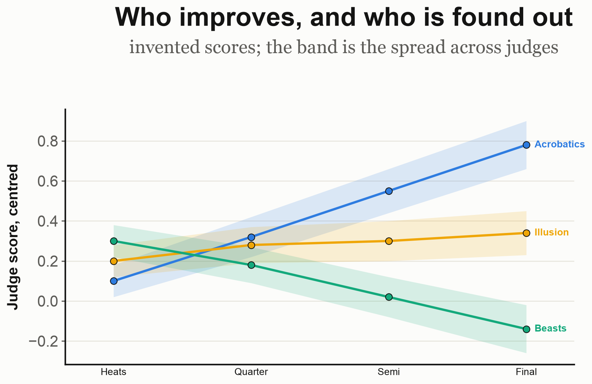
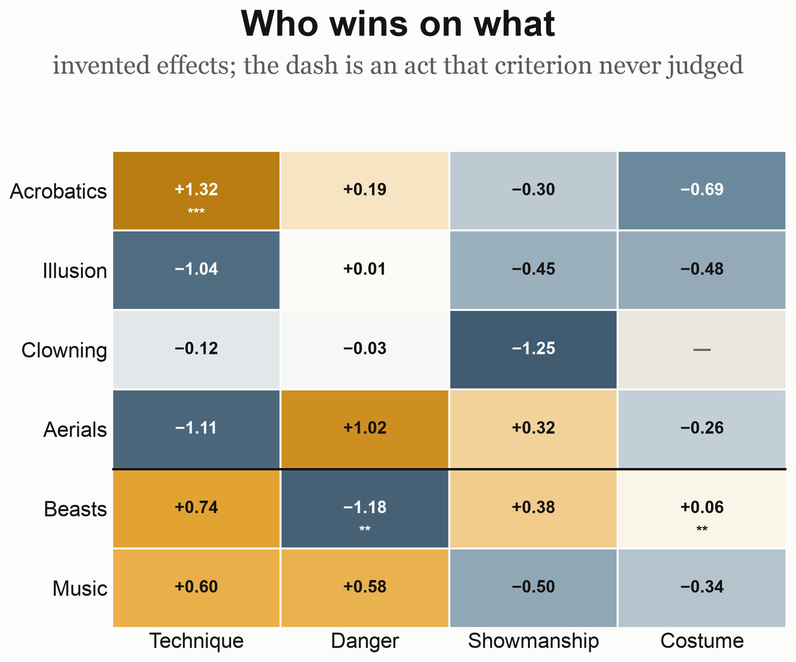
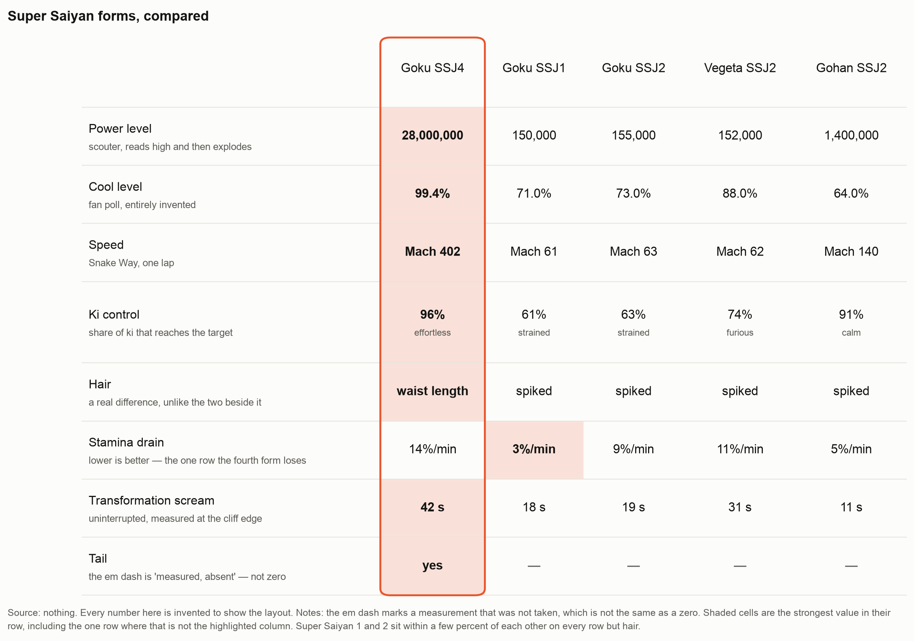
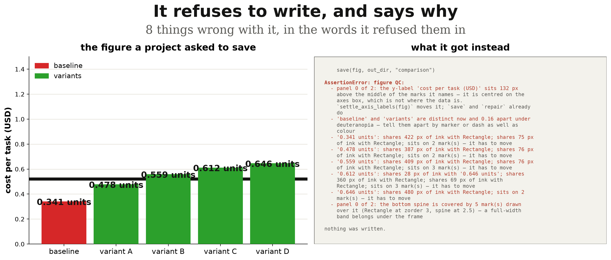

<!-- generated from README.md.in by generate_readme.py — do not edit -->
# ogviz

My favourite way to draw a figure, packaged so I stop rebuilding it: one house style, violins,
significance brackets, bar panels, spectrograms, and the small tricks that keep them working when
the data changes shape.

The part I actually rely on is that it refuses to save a bad figure. Labels sitting on each other,
an axis buried behind the bars, a star closer to one bracket than the next, two series that are the
same colour to a reader with colour-vision deficiency — it checks the rendered pixels and raises
instead of writing. Colours, p-values and units stay yours.

```bash
uv add "ogviz @ git+https://github.com/OrenGurevitch/ogviz"
```

```python
import matplotlib.pyplot as plt

from ogviz import fit_under_header, group_violins, save, titled, use_house_style, value_ticks

use_house_style()
fig, ax = plt.subplots(figsize=(7, 8))
group_violins(ax, [(0.0, control, "#E8A838", "#B97C10"),
                   (1.0, treated, "#7C9A6E", "#4A6136")],
              comparisons=[(0.0, 1.0, p_value)])
value_ticks(ax, count=4)
fit_under_header(fig, titled(fig, "Two groups"))   # titled returns where the header ends
save(fig, out_dir, "figure")                       # writes AND runs the gate
```

Three things the names do not give away:

- **`save` runs the gate and raises instead of writing.** It also closes the figure.
- **`titled` returns a float** — where the header ends. `fit_under_header` needs it, or the panels
  grow into the title.
- **`use_house_style()` once per process.** Pass `PAPER_WHITE` for a manuscript; the default page is
  a warm off-white that composites as a grey rectangle on a journal's white.

Everything else is documented where it lives: each function's docstring carries the reasoning and
the measurement behind it. Requires Python ≥ 3.12 and matplotlib ≥ 3.10.

## Figures

`uv run just figures` renders these from invented data with fixed seeds. The source,
`examples/__main__.py`, is the specification rather than an illustration. Each panel is labelled,
so one can be asked for by name — 3E, 1C.

### 1 · Distributions

<table>
<tr>
<td width="43%"><br><sub><b>1A</b> <code>group_violins</code></sub></td>
<td width="57%"><br><sub><b>1B</b> four panels, each on its own scale</sub></td>
</tr>
<tr>
<td width="48%" rowspan="2"><br><sub><b>1C</b> a condition grid</sub></td>
<td width="52%"><br><sub><b>1D</b> <code>display_scale</code></sub></td>
</tr>
<tr>
<td width="52%"><br><sub><b>1E</b> <code>split_violins</code></sub></td>
</tr>
</table>

### 2 · Spectra

<table>
<tr>
<td width="46%"><br><sub><b>2A</b> a power spectrum</sub></td>
<td width="54%"><br><sub><b>2B</b> <code>spectrogram</code></sub></td>
</tr>
</table>

### 3 · Bars

<table>
<tr>
<td width="47%"><br><sub><b>3A</b> <code>bar_panel</code></sub></td>
<td width="53%"><br><sub><b>3B</b> one bar that does not compare</sub></td>
</tr>
<tr>
<td width="39%"><br><sub><b>3C</b> two series, sign-aware labels</sub></td>
<td width="61%"><br><sub><b>3D</b> <code>orientation="horizontal"</code></sub></td>
</tr>
</table>



<sub><b>3E</b> a metric grid</sub>

### 4 · Curves, coupling and change

<table>
<tr>
<td width="55%"><br><sub><b>4A</b> <code>line_panel</code></sub></td>
<td width="45%"><br><sub><b>4B</b> <code>slopegraph</code></sub></td>
</tr>
<tr>
<td colspan="2"><br><sub><b>4C</b> <code>coupling_panels</code>; its lower half is <code>estimate_strip</code>, which works standalone</sub></td>
</tr>
</table>

### 5 · Matrices and tables

<table>
<tr>
<td width="46%"><br><sub><b>5A</b> <code>effect_heatmap</code></sub></td>
<td width="54%"><br><sub><b>5B</b> <code>table_panel</code></sub></td>
</tr>
</table>

## The QC gate



<sub><b>6</b> every word on the right comes from <code>audit</code></sub>

`save` runs it. `guard()` extends it to every `fig.savefig`, whoever called it; `OGVIZ_GUARD=1` does
the same with no code change. Both also refuse a tofu box — text with no glyph in the resolved font.

It catches colliding text, labels sitting on the marks, clipped ink, buried spines and thresholds,
stars at uneven distances, dots on the mean line, ungrouped thousands, mixed minus signs, and two
legend series that merge under colour-vision deficiency. `--list-checks` prints the current set.

Where a linter reads a chart specification, these read the RENDERED figure — so they work on any
matplotlib figure, from any project:

```bash
uv run python -m ogviz.qc mypackage.figures:build_panel   # a callable returning a figure
uv run python -m ogviz.qc scripts/make_figures.py         # a script; every figure it leaves open
uv run python -m ogviz.qc scripts/make_figures.py --fix out/
uv run python -m ogviz.qc --list-checks
```

Exit 0 when clean, 1 otherwise. `--fix` changes presentation only — a label moved, a knockout added,
a buried line raised — and leaves what it cannot decide. From Python: `audit(fig)`, `repair(fig)`,
`assert_clean(fig)`, and `type_too_small(fig, column_width=...)` for whether the smallest type still
clears 5 pt at the width the figure will be printed at.

## Testing

`uv run just` is the full local gate, and it writes: reformats, regenerates the gallery, rebuilds
this file. `uv run just ci` is the read-only subset CI runs, on matplotlib 3.10 and 3.11.

<details>
<summary><b>Module tree</b> — generated with <a href="https://github.com/yberreby/pypatree">pypatree</a></summary>

```text
ogviz
├── color
│   ├── indistinguishable_series(colors: dict[str, str], *, threshold: float) -> list[str]
│   ├── separation(first: str, second: str, deficiency: Deficiency | None) -> float
│   └── simulate(...) -> ...
├── guard
│   ├── FigureQuality(*args, **kwargs)
│   ├── FigureRejectedError(*args, **kwargs)
│   ├── guard(*, mode: Mode, min_gap: float | None, advise: bool) -> None
│   ├── guard_from_environment() -> bool
│   ├── guarded(**settings: object) -> Iterator[None]
│   ├── is_guarded() -> bool
│   └── unguard() -> None
├── layout
│   ├── axis
│   │   ├── drawn_value_extent(ax: Axes) -> tuple[float, float] | None
│   │   └── ticks_over_data(...) -> ...
│   ├── bounds
│   │   ├── figure_text(...) -> ...
│   │   ├── panel_text(ax: Axes, *, ticks: bool, legend: bool) -> Iterator[Text]
│   │   ├── text_off_canvas(fig: Figure) -> list[str]
│   │   └── text_wider_than_its_panel(fig: Figure) -> list[str]
│   ├── caption
│   │   ├── caption(...) -> ...
│   │   ├── longest_unbreakable(text: str, size: float) -> float
│   │   └── overflowing_text(fig: Figure) -> list[str]
│   ├── collision
│   │   ├── MarkCloud(*args, **kwargs)
│   │   ├── PanelMarks(*args, **kwargs)
│   │   ├── annotate_clear(...)
│   │   ├── clear_position(...) -> ...
│   │   ├── data_paths(ax: Axes) -> list[tuple[Path, bool]]
│   │   ├── data_points(ax: Axes) -> list[MarkCloud]
│   │   ├── decoration_ids(ax: Axes) -> set[int]
│   │   ├── hits_data(ax: Axes, box: Bbox, *, padding: float, marks: PanelMarks | None) -> int
│   │   ├── hits_decoration(ax: Axes, box: Bbox, *, padding: float) -> int
│   │   ├── labels_crossing_a_rule(...) -> ...
│   │   ├── labels_on_the_marks(fig: Figure) -> list[tuple[Axes, Text, int]]
│   │   ├── point_offsets(collection: Collection) -> NDArray[np.float64] | None
│   │   ├── quoted(text: str) -> str
│   │   ├── text_box(text: Text) -> Bbox
│   │   └── text_over_data(fig: Figure) -> list[str]
│   ├── density
│   │   ├── Density(...) -> ...
│   │   ├── Margins(left: float, right: float, bottom: float, top: float) -> None
│   │   ├── data_ink_mask(fig: Figure, ax: Axes) -> NDArray[np.bool_]
│   │   ├── dead_space(fig: Figure) -> list[str]
│   │   ├── figure_margins(fig: Figure, *, tolerance: int) -> Margins | None
│   │   ├── ink_mask(fig: Figure, *, tolerance: int) -> NDArray[np.bool_]
│   │   ├── measure(fig: Figure) -> Density
│   │   ├── panel_emptiness(fig: Figure, ax: Axes) -> dict[str, float]
│   │   ├── required_margins(figures: Iterable[Figure], *, pad: float) -> Margins
│   │   └── trim_margins(fig: Figure, *, pad_px: float) -> bool
│   ├── frame
│   │   ├── baseline(ax: Axes, *, axis: "Literal[x, y]") -> None
│   │   ├── color_scale(...) -> ...
│   │   ├── hairline_grid(ax: Axes, *, axis: "Literal[x, y]") -> None
│   │   ├── is_color_scale(ax: Axes) -> bool
│   │   ├── label_rows(...) -> ...
│   │   ├── legend_pill(target: Axes | Figure, **kwargs: object) -> Legend
│   │   ├── pill_frame(legend: Legend) -> Legend
│   │   └── zero_baseline(ax: Axes) -> None
│   ├── header
│   │   ├── fit_under_header(...) -> ...
│   │   ├── panel_left_edge(fig: Figure) -> float
│   │   ├── room_below(fig: Figure, bottom: float, *, keep_panels: bool) -> float
│   │   ├── settle_header(fig: Figure) -> list[str]
│   │   └── titled(...) -> ...
│   ├── ink
│   │   ├── artist_ink(fig: Figure, artist: Artist, *, others: list[Artist] | None)
│   │   ├── exact_overlaps(...) -> ...
│   │   ├── hidden_artists(fig: Figure, artists: list[Artist], *, showing: float) -> list[int]
│   │   └── visible_contribution(fig: Figure, artist: Artist) -> NDArray[np.bool_]
│   ├── overlap
│   │   ├── assert_no_text_overlap(fig: Figure, *, min_gap: float) -> None
│   │   ├── assert_nothing_clipped(fig: Figure) -> None
│   │   ├── clipped_artists(fig: Figure) -> list[str]
│   │   ├── drawn_tick_labels(ax: Axes) -> list[Text]
│   │   ├── opaque_backing(text: Text) -> Bbox | None
│   │   ├── text_hidden_behind_knockouts(fig: Figure) -> list[str]
│   │   └── text_overlaps(fig: Figure, *, min_gap: float) -> list[str]
│   ├── panels
│   │   ├── grid_warnings(fig: Figure) -> list[str]
│   │   ├── panel_grid(...) -> ...
│   │   ├── panel_row(...) -> ...
│   │   ├── rows_that_fit(...) -> ...
│   │   ├── settle_caption(fig: Figure, *, gap_px: float) -> bool
│   │   ├── text_width_points(text: str, fontsize: float) -> float
│   │   ├── width_for_bars(count: int, *, minimum: float, per_bar: float) -> float
│   │   ├── wrap_to_panel(ax: Axes, text: str, fontsize: float, *, fraction: float) -> list[str]
│   │   └── wrap_to_width(text: str, width_points: float, fontsize: float) -> list[str]
│   ├── raster
│   │   ├── frame_rgb(fig: Figure) -> NDArray[np.int16]
│   │   └── ink_of(frame: NDArray[np.int16], *, tolerance: int) -> NDArray[np.bool_]
│   ├── render
│   │   ├── ensure_rendered(fig: Figure) -> None
│   │   └── one_render(fig: Figure) -> Iterator[None]
│   ├── stacking
│   │   ├── place_end_labels(...) -> ...
│   │   └── stack_without_overlap(...) -> ...
│   ├── ticks
│   │   ├── auto_decimals(value: float) -> int
│   │   ├── format_value(...) -> ...
│   │   ├── round_ticks(low: float, high: float, count: int) -> list[float]
│   │   ├── settle_corner_tick(ax) -> bool
│   │   ├── typeset(text: str) -> str
│   │   └── value_ticks(...) -> ...
│   └── write
│       ├── reproducible_metadata(path: Path) -> dict[str, None]
│       └── save(...) -> ...
├── marks
│   ├── central_clearance(...) -> ...
│   ├── error_bars(...) -> ...
│   ├── iqr_box(...) -> ...
│   ├── jitter_x(...) -> ...
│   ├── mean_line(...) -> ...
│   ├── points(...) -> ...
│   ├── violin(...) -> ...
│   └── widths_of(*mark_kwargs: Mapping[str, object] | None) -> dict[str, float]
├── orientation
│   ├── category_limits(ax: Axes, orientation: Orientation) -> Callable[..., object]
│   ├── category_tick_labels(ax: Axes, orientation: Orientation) -> Callable[..., object]
│   ├── category_ticks(ax: Axes, orientation: Orientation) -> Callable[..., object]
│   ├── constant_value_line(...) -> ...
│   ├── is_vertical(orientation: Orientation) -> bool
│   ├── place(orientation: Orientation, category: float, value: float) -> tuple[float, float]
│   ├── place_many(orientation: Orientation, category, value) -> tuple
│   ├── read_orientation(ax: Axes) -> Orientation | None
│   ├── require_linear_value_axis(ax: Axes, orientation: Orientation, what: str) -> None
│   ├── stamp_orientation(ax: Axes, orientation: Orientation) -> None
│   ├── value_limits(ax: Axes, orientation: Orientation) -> Callable[..., object]
│   ├── value_scale(ax: Axes, orientation: Orientation) -> str
│   ├── value_span(ax: Axes, orientation: Orientation) -> tuple[float, float]
│   ├── value_transform(ax: Axes, orientation: Orientation)
│   └── violin_orientation_kwarg(orientation: Orientation) -> dict[str, object]
├── panels
│   ├── bars
│   │   ├── Series(...) -> ...
│   │   ├── bar_panel(...) -> ...
│   │   ├── default_value_format(values: NDArray[np.float64]) -> str
│   │   └── value_labels(...) -> ...
│   ├── coupling
│   │   ├── Cloud(...) -> ...
│   │   ├── Estimate(...) -> ...
│   │   ├── Leg(...) -> ...
│   │   ├── coupling_panels(...) -> ...
│   │   ├── estimate_strip(...) -> ...
│   │   ├── scatter_panel(...) -> ...
│   │   ├── shared_limits(legs: Sequence[Leg], *, pad: float) -> tuple[float, float]
│   │   └── trend_line(...) -> ...
│   ├── grid
│   │   ├── align_brackets(axes: Iterable[Axes]) -> float | None
│   │   ├── align_mean_rows(axes: Iterable[Axes], *, floor: float) -> float | None
│   │   ├── align_ticks(axes: Iterable[Axes], *, orientation: Orientation) -> list[float]
│   │   ├── label_shared_scale_once(...) -> ...
│   │   └── share_value_limits(...) -> ...
│   ├── heatmap
│   │   ├── diverging_map(colors: Sequence[str | None]) -> LinearSegmentedColormap
│   │   └── effect_heatmap(...) -> ...
│   ├── lines
│   │   ├── Line(...) -> ...
│   │   ├── broken_zero(ax: Axes, *, floor: float, zero_gap: float | None) -> None
│   │   ├── line_panel(...) -> ...
│   │   ├── money_ticks(ax: Axes, positions: Sequence[float], *, decimals: int) -> None
│   │   ├── series_colors(count: int) -> tuple[str, ...]
│   │   └── value_floor(lines: Sequence[Line], *, gap: float) -> float
│   ├── multiplicity
│   │   ├── benjamini_hochberg_rank(sorted_p: NDArray[np.float64], *, alpha: float) -> int
│   │   ├── bonferroni_threshold(count: int, *, alpha: float) -> float
│   │   └── multiplicity_ladder(...) -> ...
│   ├── reference
│   │   ├── reference_line(...)
│   │   └── slide_label_clear(ax: Axes, label: Text) -> None
│   ├── slopegraph
│   │   ├── Strand(...) -> ...
│   │   ├── crowded_ends(strands: Sequence[Strand], ax: Axes, *, gap_px: float) -> list[str]
│   │   ├── null_distance(...) -> ...
│   │   └── slopegraph(...) -> ...
│   ├── spectrogram
│   │   ├── spectrogram(...) -> ...
│   │   └── to_decibels(...) -> ...
│   ├── split
│   │   ├── half_marks(...) -> ...
│   │   ├── half_violin(...) -> ...
│   │   └── split_violins(...) -> ...
│   ├── table
│   │   ├── Cell(value: str, sub: str | None, best: bool, tone: Tone | None) -> None
│   │   ├── Layout(*args, **kwargs)
│   │   ├── Row(label: str, cells: tuple[Cell, ...], sub: str | None, height: float) -> None
│   │   ├── table_panel(...) -> ...
│   │   └── tint(color: str, *, strength: float) -> tuple[float, float, float, float]
│   └── violins
│       ├── group_violins(...) -> ...
│       └── printed_means(...) -> ...
├── qc
│   ├── assert_clean(fig: Figure, *, min_gap: float) -> None
│   ├── audit(fig: Figure, *, thorough: bool, min_gap: float) -> list[str]
│   ├── __main__
│   │   └── main(argv: Sequence[str] | None) -> int
│   ├── arrangement
│   │   ├── layout_not_applied(fig: Figure) -> list[str]
│   │   ├── mean_rows_unaligned(fig: Figure) -> list[str]
│   │   ├── panels_disagree_about_ticks(fig: Figure) -> list[str]
│   │   ├── rows_outside_their_panel(fig: Figure) -> list[str]
│   │   └── ticks_in_the_headroom(fig: Figure) -> list[str]
│   ├── color
│   │   └── series_confusable_under_cvd(fig: Figure) -> list[str]
│   ├── ink
│   │   ├── colliding_ink(fig: Figure) -> list[str]
│   │   └── drawn_but_invisible(fig: Figure) -> list[str]
│   ├── marks
│   │   ├── buried_baselines(fig: Figure) -> list[str]
│   │   └── dots_off_the_marks(fig: Figure) -> list[str]
│   ├── reading
│   │   ├── artist_name(artist) -> str
│   │   ├── bracket_spans_px(ax: Axes) -> list[tuple[float, float, float]]
│   │   ├── bracket_tops_px(ax: Axes) -> list[float]
│   │   ├── drawn_artists(ax) -> list
│   │   ├── filled_marks_over(ax: Axes, box, zorder: float) -> list
│   │   ├── is_backdrop(artist) -> bool
│   │   ├── is_excused(label, other) -> bool
│   │   ├── knocked_out_over(label, other) -> bool
│   │   └── orientation_of(ax: Axes) -> str
│   ├── repair
│   │   ├── knock_out_labels_over_rules(...) -> ...
│   │   ├── move_labels_off_the_marks(...) -> ...
│   │   ├── raise_buried_lines(fig: Figure) -> list[str]
│   │   └── repair(fig: Figure) -> list[str]
│   ├── report
│   │   ├── group_by_subject(complaints: list[str]) -> list[str]
│   │   └── subject_of(complaint: str) -> str | None
│   ├── significance
│   │   ├── significance_gaps(fig: Figure) -> list[str]
│   │   └── stack_spacing(fig: Figure) -> list[str]
│   └── typography
│       ├── one_minus_sign(fig: Figure) -> list[str]
│       ├── type_too_small(fig: Figure, *, column_width: float | None) -> list[str]
│       └── ungrouped_thousands(fig: Figure) -> list[str]
├── require
│   └── require(condition: object, message: str) -> None
├── significance
│   ├── bracket_stack(...) -> ...
│   ├── ink_bounds_points(text: str, fontsize: float, *, weight: str) -> tuple[float, float]
│   ├── ink_extents_points(...) -> ...
│   ├── label_size(label: str, star_size: float) -> float
│   ├── settle_bracket_labels(fig: Figure) -> list[str]
│   ├── significance_row(...) -> ...
│   ├── spaced_stars(p: float) -> str
│   └── stars(p: float) -> str
├── tags
│   ├── mark(artist: Artist | Figure, tag: Tag, value: Any) -> None
│   ├── marked(artist: Artist | Figure, tag: Tag) -> bool
│   └── value_of(artist: Artist | Figure, tag: Tag, default: Any) -> Any
├── theme
│   ├── family_for(text: str) -> str | None
│   ├── glyphs_must_render() -> Iterator[None]
│   ├── house_style(canvas: str) -> Iterator[None]
│   ├── identity_colors(count: int, *, saturation: float, value: float) -> tuple[str, ...]
│   ├── page_color() -> str
│   ├── use_house_ink(canvas: str) -> None
│   ├── use_house_style(canvas: str) -> None
│   ├── use_house_type() -> None
│   └── use_reproducible_svg() -> None
└── units
    ├── inches_to_points(inches: float) -> float
    ├── midpoint(ax: Axes, low: float, high: float, *, orientation: str) -> float
    ├── panel_px(ax: Axes, *, orientation: str) -> float
    ├── px_per_point(fig: Figure | SubFigure) -> float
    ├── px_to_value(ax: Axes, pixels: float, *, orientation: str) -> float
    ├── to_points(pixels: float, *, fig: Figure | SubFigure) -> float
    ├── to_px(value: float, unit: Unit, *, fig: Figure | SubFigure, em: float | None) -> float
    └── value_to_px(ax: Axes, value: float, *, orientation: str) -> float
```

</details>

## Credit

The ideas behind how this package places and checks things:

- **McNutt and Kindlmann**, **Hopkins et al.** (VisuaLint) and **Chen et al.** — the visualization
  linter, and pairing one with a fixer, which is `audit` and `repair`.
- **Viénot, Brettel and Mollon** — the dichromat simulation in `ogviz/color.py`.
- **Crameri et al.** — the scientific colour maps.
- **Hintze and Nelson** — the violin plot; **Tufte** — the slopegraph, and data-ink.
- **Christensen, Marks and Shieber** — why label placement is solved by heuristics: the general
  case is NP-hard, which is why `stack_without_overlap` solves only the one-dimensional one.

Tools: [pypatree](https://github.com/yberreby/pypatree) generates the module tree;
`colorspacious`, `daltonlens` and `cmcrameri` are what to use when the colour answer must be exact.
`ogviz/color.py` says what its own shortcuts cost.

## License

MIT.
