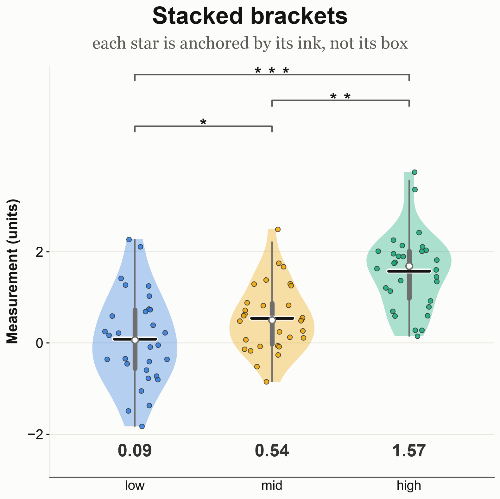
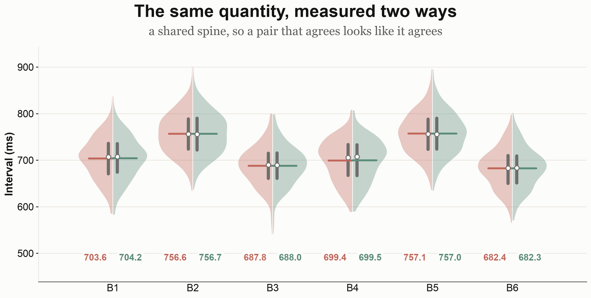
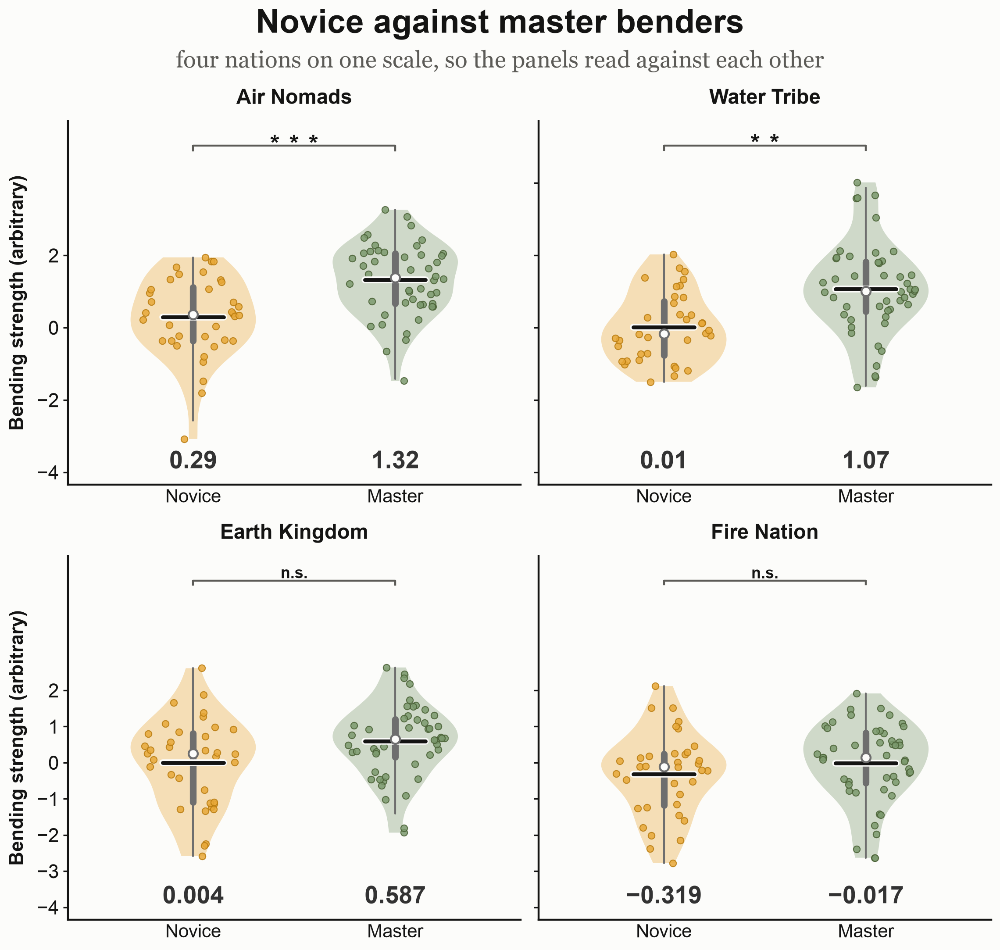
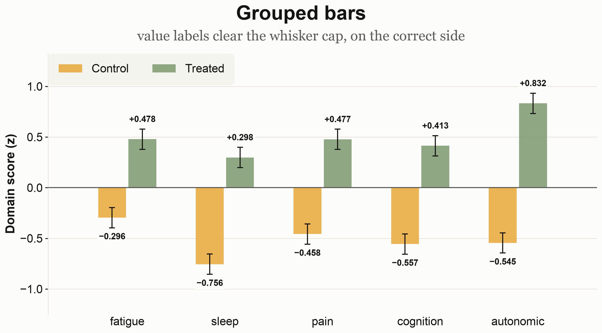
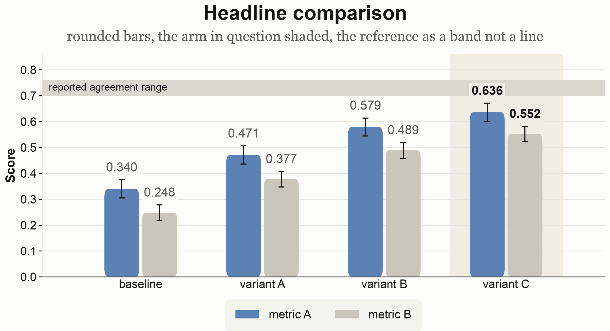
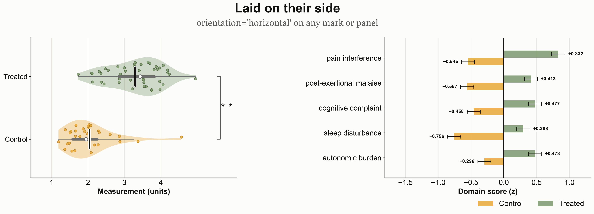
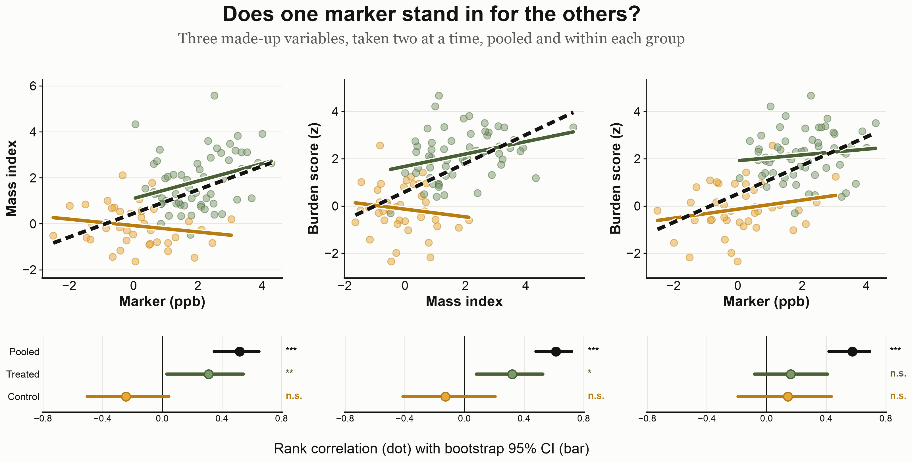
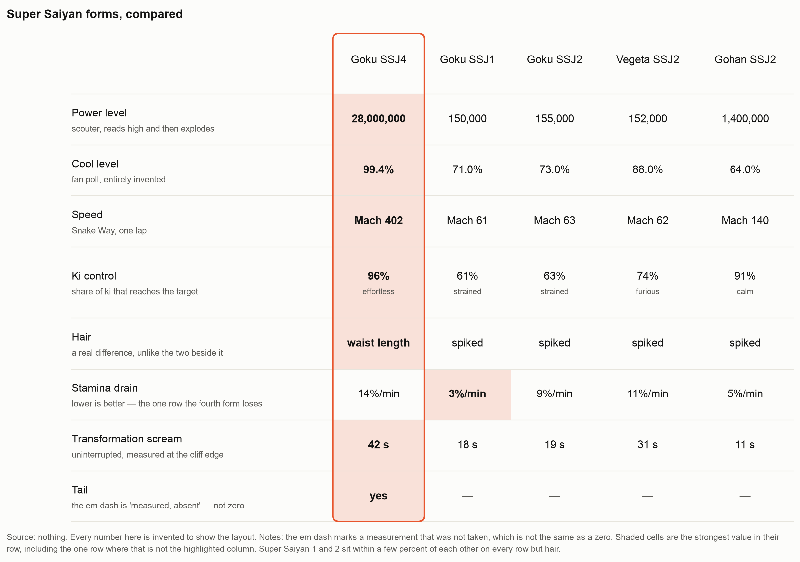

<!-- generated from README.md.in by generate_readme.py — do not edit -->
# ogviz

Shared matplotlib figure code: style, violins, significance brackets, bar panels. Colours,
p-values and units are passed in.

```bash
uv add "ogviz @ git+https://github.com/OrenGurevitch/ogviz"
```

```python
from ogviz import group_violins, save, titled, use_house_style, value_ticks

use_house_style()
fig, ax = plt.subplots(figsize=(7, 8))
group_violins(ax, [(0.0, control, "#E8A838", "#B97C10"),
                   (1.0, treated, "#7C9A6E", "#4A6136")],
              comparisons=[(0.0, 1.0, p_value)], display_scale=1e3)
value_ticks(ax, count=4, scale=1e3)
titled(fig, "Two groups")
save(fig, out_dir, "figure")
```

## Testing

`uv run just` — lint, format, typecheck, test. `uv run just strict` turns deprecations into
errors. CI runs matplotlib 3.10 and 3.11.

## Examples

`uv run just figures` renders `examples/out/` from made-up data with fixed seeds, PNG and SVG.
Source: `examples/__main__.py`.

### Violins

| | |
|---|---|
|  |  |
| `group_violins` — marks, limits, printed means, bracket | `display_scale` — stored in ppm, drawn in ppb |
|  |  |
| `bracket_stack` — stars anchored by their ink | `split_violins` — one quantity, two measurements |
|  | |
| `share_value_limits` — one scale, one line of printed means | |

### Bars

| | |
|---|---|
|  |  |
| `bar_panel` — signed bars, sign-aware labels | asymmetric CI, a threshold drawn over the bars |
|  |  |
| `rounded` / `highlight` / `reference_band` | `orientation="horizontal"`, for names too long for a tick |

### Relationships over a continuous axis

| | |
|---|---|
|  |  |
| `coupling_panels` — pairs above, estimates and stars on one scale below | `line_panel` — measured points, log money axis, `broken_zero` |

### A table drawn as a figure

| | |
|---|---|
|  | |
| `table_panel` — highlighted column, shaded best value, `caption` | |

## Captions

Off unless asked for. `caption(fig, note, heading=...)` puts a bold claim above the figure and a
grey source note below, both wrapped to the figure width — measured from the render and re-wrapped
until they fit, at any figure size. A word too long to break is reported by name rather than shrunk.

## Checks

`save` runs `ogviz.qc.assert_clean` and raises instead of writing. It catches:

- text that collides, or sits under 5 px from its neighbour on the same row
- text sitting on the marks, or crossing a gridline with nothing behind it
- a caption wider than the figure it belongs to
- a mark clipped outside the axes
- a spine or a threshold buried under the marks it is read against
- a value tick in the space held open for a bracket stack
- stars at different distances from their brackets, or an uneven stack
- a jittered dot on the mean line, the box or the median
- a glyph missing from the resolved font
- a non-finite value, a p outside [0, 1], two groups at one position, an empty tick range

`test_qc.py` runs them over the examples, with a planted defect each.

## Module tree

<sub>generated with [pypatree](https://github.com/yberreby/pypatree)</sub>

```text
ogviz
├── layout
│   ├── align_mean_rows(axes, *, floor: float) -> float | None
│   ├── baseline(ax: Axes, *, axis: "Literal[x, y]") -> None
│   ├── drawn_value_extent(ax) -> tuple[float, float] | None
│   ├── fit_under_header(...) -> ...
│   ├── hairline_grid(ax: Axes, *, axis: "Literal[x, y]") -> None
│   ├── legend_pill(target: Axes | Figure, **kwargs: object) -> Legend
│   ├── pill_frame(legend: Legend) -> Legend
│   ├── save(...) -> ...
│   ├── share_value_limits(axes, *, orientation: str) -> tuple[float, float]
│   ├── ticks_over_data(ax, data_high: float, *, orientation: str) -> None
│   ├── titled(...) -> ...
│   ├── zero_baseline(ax: Axes) -> None
│   ├── caption
│   │   ├── caption(...) -> ...
│   │   ├── longest_unbreakable(text: str, size: float) -> float
│   │   └── overflowing_text(fig: Figure) -> list[str]
│   ├── collision
│   │   ├── annotate_clear(...)
│   │   ├── clear_position(...) -> ...
│   │   ├── data_paths(ax: Axes) -> list[tuple[Path, bool]]
│   │   ├── hits_data(ax: Axes, box: Bbox, *, padding: float) -> int
│   │   ├── hits_decoration(ax: Axes, box: Bbox, *, padding: float) -> int
│   │   ├── text_box(text: Text) -> Bbox
│   │   └── text_over_data(fig: Figure) -> list[str]
│   ├── density
│   │   ├── Density(...) -> ...
│   │   ├── data_ink_mask(fig: Figure, ax: Axes) -> NDArray[np.bool_]
│   │   ├── dead_space(fig: Figure) -> list[str]
│   │   ├── ink_mask(fig: Figure, *, tolerance: int) -> NDArray[np.bool_]
│   │   ├── measure(fig: Figure) -> Density
│   │   ├── panel_emptiness(fig: Figure, ax: Axes) -> dict[str, float]
│   │   └── trim_margins(fig: Figure, *, pad_px: float) -> bool
│   ├── ink
│   │   ├── artist_ink(fig: Figure, artist: Artist, *, others: list[Artist] | None)
│   │   └── exact_overlaps(...) -> ...
│   ├── overlap
│   │   ├── assert_no_text_overlap(...) -> ...
│   │   ├── assert_nothing_clipped(fig: Figure) -> None
│   │   ├── clipped_artists(fig: Figure) -> list[str]
│   │   └── text_overlaps( fig: Figure, *, min_overlap: float, min_gap: float, ) -> list[str]
│   ├── panels
│   │   ├── panel_row(...) -> ...
│   │   ├── text_width_points(text: str, fontsize: float) -> float
│   │   └── wrap_to_width( text: str, width_points: float, fontsize: float, ) -> list[str]
│   └── ticks
│       ├── auto_decimals(value: float) -> int
│       ├── format_value(...) -> ...
│       ├── round_ticks(low: float, high: float, count: int) -> list[float]
│       ├── typeset(text: str) -> str
│       └── value_ticks(...) -> ...
├── marks
│   ├── central_clearance(...) -> ...
│   ├── iqr_box(...) -> ...
│   ├── jitter_x(...) -> ...
│   ├── mean_line(...) -> ...
│   ├── points(...) -> ...
│   └── violin(...) -> ...
├── orientation
│   ├── category_limits( ax: Axes, orientation: Orientation, ) -> Callable[..., object]
│   ├── category_tick_labels( ax: Axes, orientation: Orientation, ) -> Callable[..., object]
│   ├── category_ticks( ax: Axes, orientation: Orientation, ) -> Callable[..., object]
│   ├── constant_value_line(...) -> ...
│   ├── is_vertical(orientation: Orientation) -> bool
│   ├── place( orientation: Orientation, category: float, value: float, ) -> tuple[float, float]
│   ├── place_many(orientation: Orientation, category, value) -> tuple
│   ├── require_linear_value_axis( ax: Axes, orientation: Orientation, what: str, ) -> None
│   ├── value_limits(ax: Axes, orientation: Orientation) -> Callable[...,
│   │   object]
│   ├── value_scale(ax: Axes, orientation: Orientation) -> str
│   ├── value_span(ax: Axes, orientation: Orientation) -> tuple[float, float]
│   ├── value_transform(ax: Axes, orientation: Orientation)
│   └── violin_orientation_kwarg(orientation: Orientation) -> dict[str, object]
├── panels
│   ├── bars
│   │   ├── Series(...) -> ...
│   │   ├── bar_panel(...) -> ...
│   │   ├── default_value_format(values: NDArray[np.float64]) -> str
│   │   ├── reference_line(...)
│   │   └── value_labels(...) -> ...
│   ├── coupling
│   │   ├── Cloud(...) -> ...
│   │   ├── Estimate(...) -> ...
│   │   ├── Leg(...) -> ...
│   │   ├── coupling_panels(...) -> ...
│   │   ├── estimate_strip(...) -> ...
│   │   ├── scatter_panel(...) -> ...
│   │   ├── shared_limits(legs: Sequence[Leg], *, pad: float) -> tuple[float,
│   │   │   float]
│   │   └── trend_line(...) -> ...
│   ├── lines
│   │   ├── Line(...) -> ...
│   │   ├── broken_zero(ax: Axes, *, floor: float, zero_gap: float | None) ->
│   │   │   None
│   │   ├── line_panel(...) -> ...
│   │   ├── money_ticks( ax: Axes, positions: Sequence[float], *, decimals: int, ) -> None
│   │   ├── series_colors(count: int) -> tuple[str, ...]
│   │   └── value_floor(lines: Sequence[Line], *, gap: float) -> float
│   ├── split
│   │   ├── half_marks(...) -> ...
│   │   ├── half_violin(...) -> ...
│   │   └── split_violins(...) -> ...
│   ├── table
│   │   ├── Cell(value: str, sub: str | None, best: bool) -> None
│   │   ├── Row( label: str, cells: tuple[Cell, ...], sub: str | None, height: float, ) -> None
│   │   ├── table_panel(...) -> ...
│   │   └── tint(color: str, *, strength: float) -> tuple[float, float, float,
│   │       float]
│   └── violins
│       └── group_violins(...) -> ...
├── qc
│   ├── assert_clean(fig: Figure) -> None
│   ├── audit(fig: Figure) -> list[str]
│   ├── buried_baselines(fig: Figure) -> list[str]
│   ├── colliding_ink(fig: Figure) -> list[str]
│   ├── dots_off_the_marks(fig: Figure) -> list[str]
│   ├── mean_rows_unaligned(fig: Figure) -> list[str]
│   ├── one_minus_sign(fig: Figure) -> list[str]
│   ├── rows_outside_their_panel(fig: Figure) -> list[str]
│   ├── significance_gaps(fig: Figure) -> list[str]
│   ├── stack_spacing(fig: Figure) -> list[str]
│   └── ticks_in_the_headroom(fig: Figure) -> list[str]
├── significance
│   ├── bracket_stack(...) -> ...
│   ├── ink_bounds_points( text: str, fontsize: float, *, weight: str, ) -> tuple[float, float]
│   ├── ink_extents_points(...) -> ...
│   ├── label_size(label: str, star_size: float) -> float
│   ├── spaced_stars(p: float) -> str
│   └── stars(p: float) -> str
└── theme
    ├── glyphs_must_render() -> Iterator[None]
    ├── house_style(canvas: str) -> Iterator[None]
    ├── page_color() -> str
    └── use_house_style(canvas: str) -> None
```

## License

MIT.
