<!-- generated from README.md.in by generate_readme.py — do not edit -->
# ogviz

Shared matplotlib figure code: style, violins, significance brackets, bar panels. Colours,
p-values and units are passed in.

```bash
uv add "ogviz @ git+https://github.com/OrenGurevitch/ogviz"
```

```python
from ogviz import group_violins, save, titled, use_house_style, value_ticks

use_house_style()
fig, ax = plt.subplots(figsize=(7, 8))
group_violins(ax, [(0.0, control, "#E8A838", "#B97C10"),
                   (1.0, treated, "#7C9A6E", "#4A6136")],
              comparisons=[(0.0, 1.0, p_value)], display_scale=1e3)
value_ticks(ax, count=4, scale=1e3)
titled(fig, "Two groups")
save(fig, out_dir, "figure")
```

## Testing

`uv run just` — lint, format, typecheck, test. `uv run just strict` turns deprecations into
errors. CI runs matplotlib 3.10 and 3.11.

## Examples

`uv run just figures` renders `examples/out/` from made-up data with fixed seeds, PNG and SVG.
Source: `examples/__main__.py`.

### Violins

Each row adds one thing to the row above it.

| | |
|---|---|
| 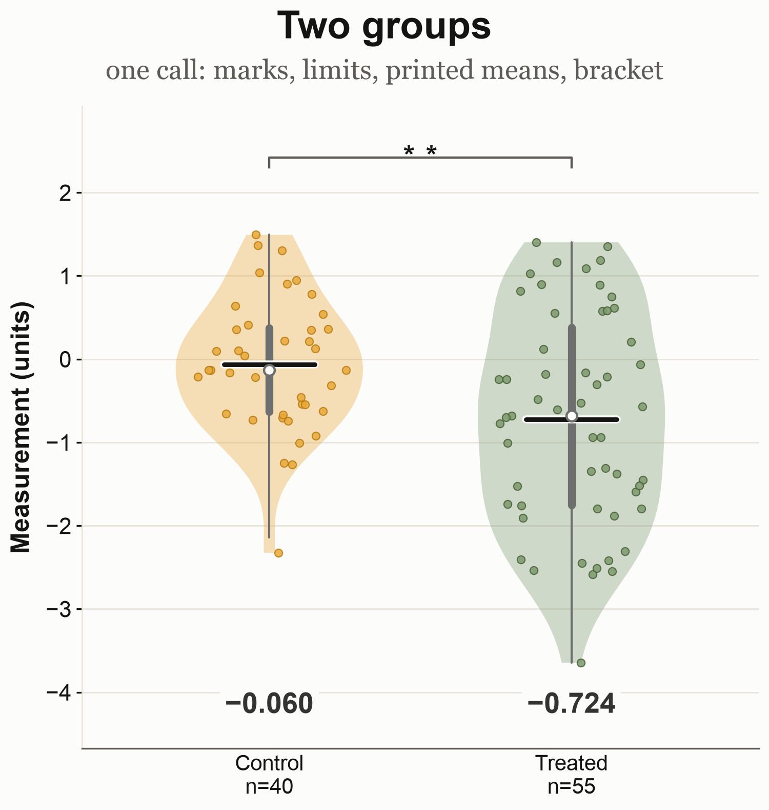 | 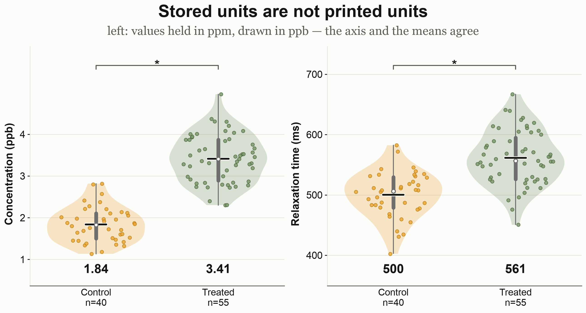 |
| one panel — marks, limits, printed means, bracket | two panels — `display_scale`, stored in ppm and drawn in ppb |
| 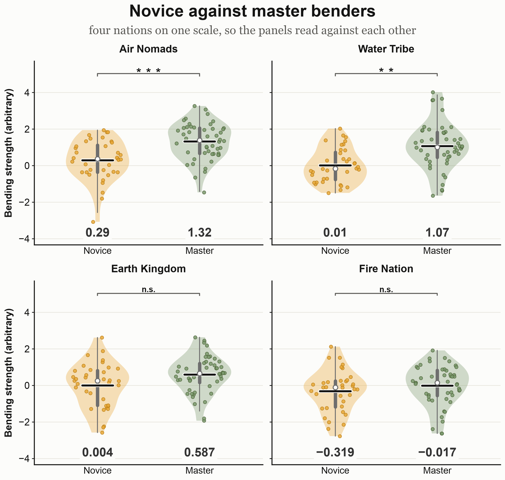 | 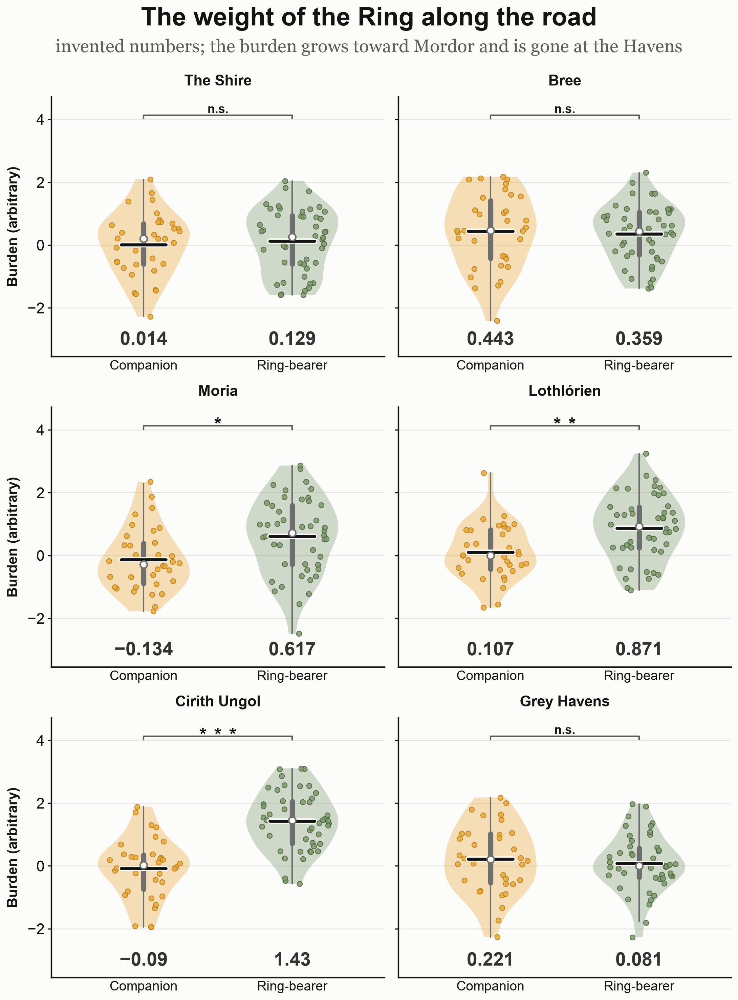 |
| 2x2 — `share_value_limits` puts the panels on one scale, one line of means | 2 columns by 3 rows — the same rules, six panels |
| 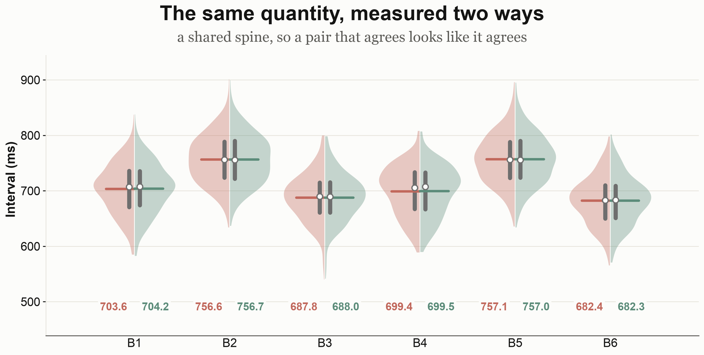 | 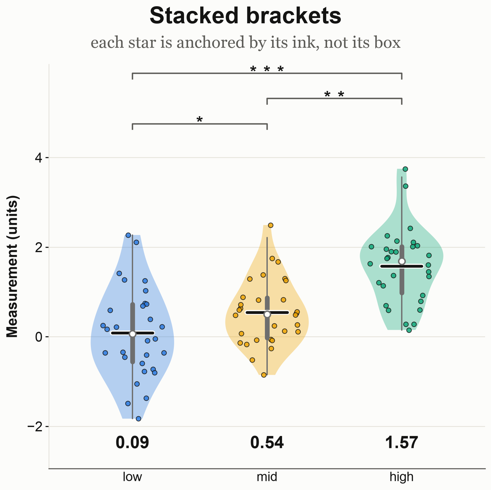 |
| `split_violins` — one quantity measured two ways, sharing a spine | three groups — `bracket_stack`, stars anchored by their ink |

### Bars

| | |
|---|---|
| 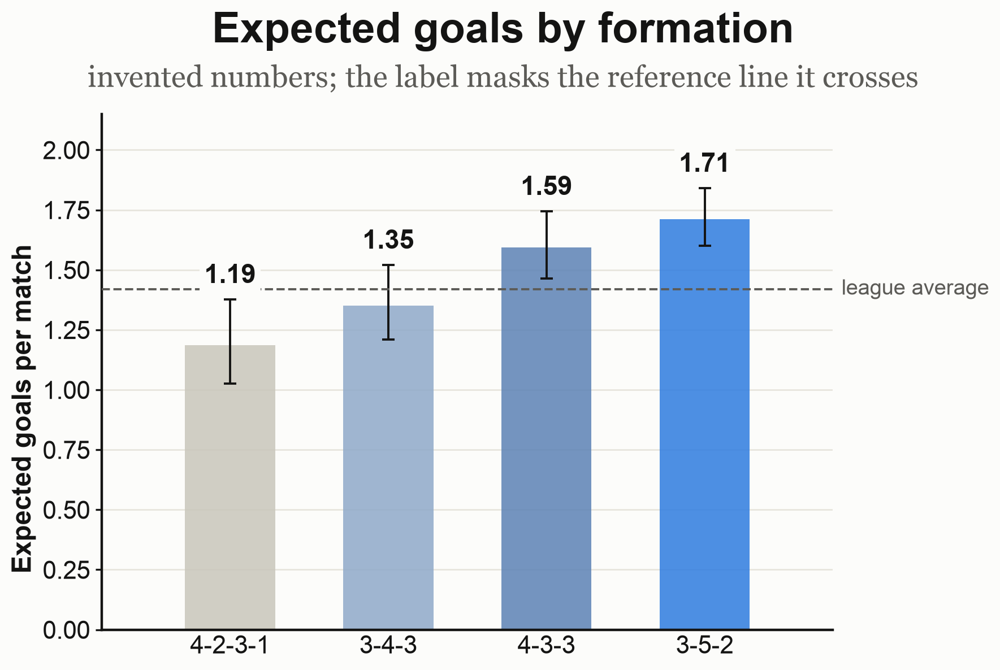 |  |
| one series, an asymmetric CI, a threshold drawn over the bars | two series — signed bars, sign-aware labels |
|  | 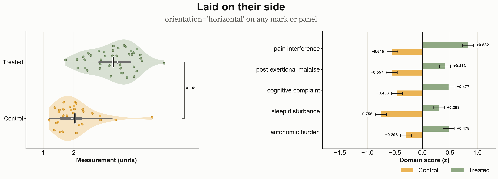 |
| `rounded` / `highlight` / `reference_band` | `orientation="horizontal"`, for names too long for a tick |

### Relationships over a continuous axis

| | |
|---|---|
| 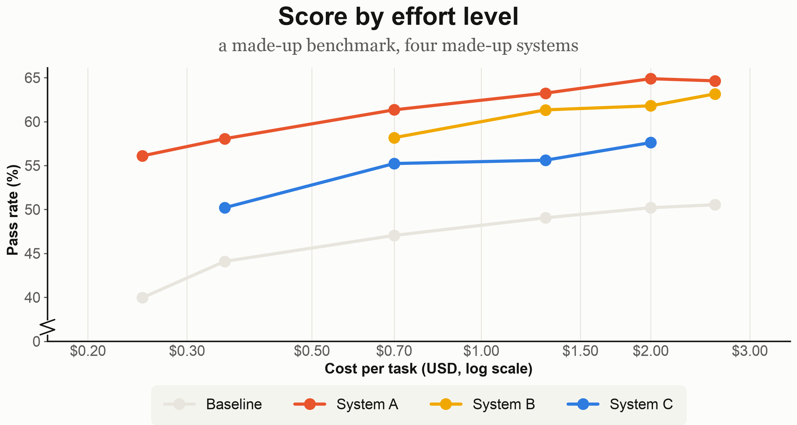 | 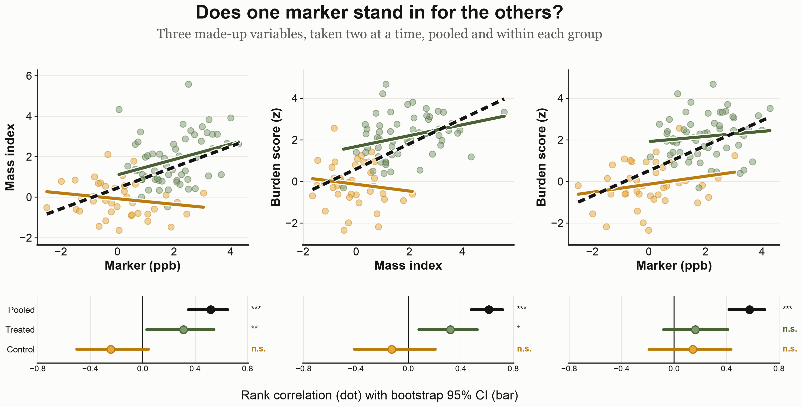 |
| `line_panel` — measured points, log money axis, `broken_zero` | `coupling_panels` — pairs above, their estimates and stars below |

### A family of tests, treated as a family

| | |
|---|---|
| 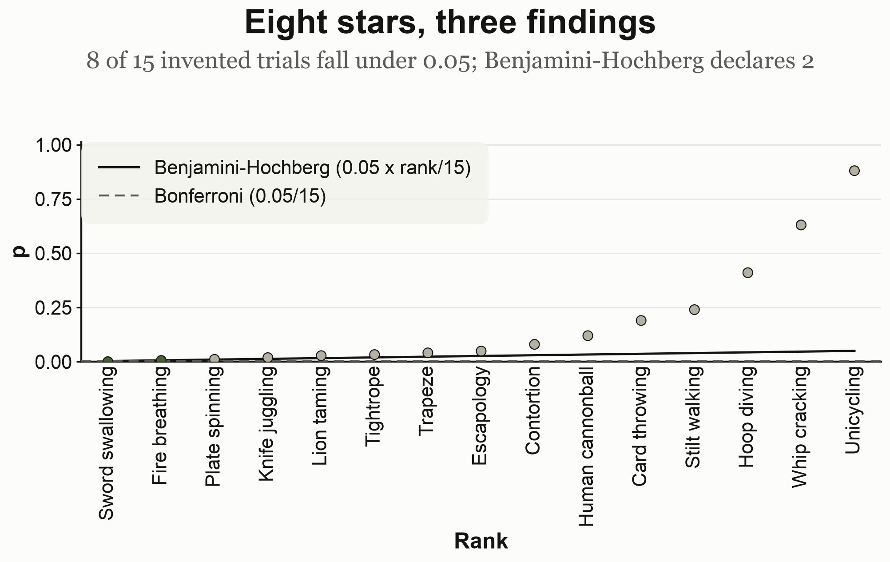 | |
| `multiplicity_ladder` — sorted p against the Bonferroni line and the Benjamini-Hochberg ramp | |

Eight stars in a table read as eight findings. Drawing the ramp shows where the cutoff really falls
and why: BH declares every test at or below the largest rank that clears the line, including points
sitting above it. `benjamini_hochberg_rank` and `bonferroni_threshold` are available on their own.

### A table drawn as a figure

| | |
|---|---|
| 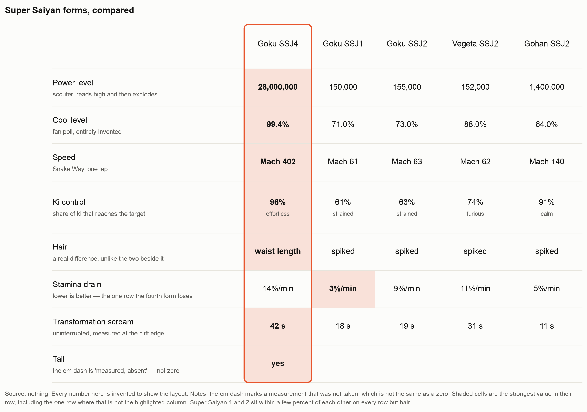 | |
| `table_panel` — highlighted column, shaded best value, `caption` | |

## Captions

Off unless asked for. `caption(fig, note, heading=...)` puts a bold claim above the figure and a
grey source note below, both wrapped to the figure width — measured from the render and re-wrapped
until they fit, at any figure size. A word too long to break is reported by name rather than shrunk.

## Using it only to find figure problems

The checks need nothing else from this package. Point them at any matplotlib figure, from any
project, drawn any way.

```bash
uv run python -m ogviz.qc mypackage.figures:build_panel   # a callable that returns a figure
uv run python -m ogviz.qc scripts/make_figures.py         # a script; every figure it leaves open
uv run python -m ogviz.qc scripts/make_figures.py --fix out/   # repair what it can, write to out/
uv run python -m ogviz.qc scripts/make_figures.py --thorough  # also the slow, exact ones
uv run python -m ogviz.qc --list-checks
```

Exit 0 when nothing is outstanding, 1 otherwise, so it sits in CI beside the tests. The target is
executed — artists have to exist before they can be measured.

`--fix` changes only presentation: a label moves off the marks, a knockout appears behind one
crossing a gridline, a buried spine or threshold is raised above what covers it. Nothing moves a
mark, changes a limit or alters a value. What it cannot decide it reports and leaves — two series
that merge under colour-vision deficiency need a marker, a dash or a different palette, and which
one is yours to pick.

```
figure_1:
  - 'alpha' and 'beta' are distinct now and 0.10 apart under deuteranopia
  - 'a label right on the curves' sits on 2 mark(s) — it has to move
  fixed: moved 'a label right on the curves' clear of the marks
  wrote out/figure_1.png
  still needs a person: 'alpha' and 'beta' are distinct now and 0.10 apart under deuteranopia
```

From Python:

```python
from ogviz.qc import audit, assert_clean
from ogviz.qc.repair import repair

audit(fig)         # every complaint, as strings
repair(fig)        # fix what has one obvious fix; returns what changed
assert_clean(fig)  # raise rather than ship it
```

Checks that read an ogviz tag — where a printed mean belongs, whether a star sits against its
bracket — say nothing about a figure that has none. The rest apply to anything.

## Checks

`save` runs `ogviz.qc.assert_clean` and raises instead of writing. It catches:

- text that collides, or sits under 5 px from its neighbour on the same row
- text sitting on the marks, or crossing a gridline with nothing behind it
- a caption wider than the figure it belongs to
- two legend series that separate now and merge under colour-vision deficiency
- a mark clipped outside the axes
- a spine or a threshold buried under the marks it is read against
- a value tick in the space held open for a bracket stack
- panels on one scale carrying different value ticks
- stars at different distances from their brackets, or an uneven stack
- a jittered dot on the mean line, the box or the median
- a glyph missing from the resolved font
- a non-finite value, a p outside [0, 1], two groups at one position, an empty tick range

`test_qc.py` runs them over the examples, with a planted defect each.

## Module tree

<sub>generated with [pypatree](https://github.com/yberreby/pypatree)</sub>

```text
ogviz
├── color
│   ├── indistinguishable_series(colors: dict[str, str], *, threshold: float) -> list[str]
│   ├── separation(first: str, second: str, deficiency: Deficiency | None) -> float
│   └── simulate(...) -> ...
├── layout
│   ├── axis
│   │   ├── drawn_value_extent(ax: Axes) -> tuple[float, float] | None
│   │   └── ticks_over_data(...) -> ...
│   ├── bounds
│   │   ├── figure_text(fig: Figure) -> Iterator[tuple[Text, Axes | None]]
│   │   ├── panel_text(ax: Axes) -> Iterator[Text]
│   │   ├── text_off_canvas(fig: Figure) -> list[str]
│   │   └── text_wider_than_its_panel(fig: Figure) -> list[str]
│   ├── caption
│   │   ├── caption(...) -> ...
│   │   ├── longest_unbreakable(text: str, size: float) -> float
│   │   └── overflowing_text(fig: Figure) -> list[str]
│   ├── collision
│   │   ├── MarkCloud(*args, **kwargs)
│   │   ├── annotate_clear(...)
│   │   ├── clear_position(...) -> ...
│   │   ├── data_paths(ax: Axes) -> list[tuple[Path, bool]]
│   │   ├── data_points(ax: Axes) -> list[MarkCloud]
│   │   ├── decoration_ids(ax: Axes) -> set[int]
│   │   ├── hits_data(ax: Axes, box: Bbox, *, padding: float) -> int
│   │   ├── hits_decoration(ax: Axes, box: Bbox, *, padding: float) -> int
│   │   ├── point_offsets(collection: Collection) -> NDArray[np.float64] | None
│   │   ├── quoted(text: str) -> str
│   │   ├── text_box(text: Text) -> Bbox
│   │   └── text_over_data(fig: Figure) -> list[str]
│   ├── density
│   │   ├── Density(...) -> ...
│   │   ├── data_ink_mask(fig: Figure, ax: Axes) -> NDArray[np.bool_]
│   │   ├── dead_space(fig: Figure) -> list[str]
│   │   ├── ink_mask(fig: Figure, *, tolerance: int) -> NDArray[np.bool_]
│   │   ├── measure(fig: Figure) -> Density
│   │   ├── panel_emptiness(fig: Figure, ax: Axes) -> dict[str, float]
│   │   └── trim_margins(fig: Figure, *, pad_px: float) -> bool
│   ├── frame
│   │   ├── baseline(ax: Axes, *, axis: "Literal[x, y]") -> None
│   │   ├── hairline_grid(ax: Axes, *, axis: "Literal[x, y]") -> None
│   │   ├── legend_pill(target: Axes | Figure, **kwargs: object) -> Legend
│   │   ├── pill_frame(legend: Legend) -> Legend
│   │   └── zero_baseline(ax: Axes) -> None
│   ├── header
│   │   ├── fit_under_header(...) -> ...
│   │   ├── panel_left_edge(fig: Figure) -> float
│   │   ├── settle_header(fig: Figure) -> list[str]
│   │   └── titled(...) -> ...
│   ├── ink
│   │   ├── artist_ink(fig: Figure, artist: Artist, *, others: list[Artist] | None)
│   │   ├── exact_overlaps(...) -> ...
│   │   ├── hidden_artists(fig: Figure, artists: list[Artist], *, showing: float) -> list[int]
│   │   └── visible_contribution(fig: Figure, artist: Artist) -> NDArray[np.bool_]
│   ├── overlap
│   │   ├── assert_no_text_overlap(fig: Figure, *, min_gap: float) -> None
│   │   ├── assert_nothing_clipped(fig: Figure) -> None
│   │   ├── clipped_artists(fig: Figure) -> list[str]
│   │   ├── drawn_tick_labels(ax: Axes) -> list[Text]
│   │   ├── text_hidden_behind_knockouts(fig: Figure) -> list[str]
│   │   └── text_overlaps(fig: Figure, *, min_gap: float) -> list[str]
│   ├── panels
│   │   ├── panel_row(...) -> ...
│   │   ├── settle_caption(fig: Figure, *, gap_px: float) -> bool
│   │   ├── text_width_points(text: str, fontsize: float) -> float
│   │   └── wrap_to_width(text: str, width_points: float, fontsize: float) -> list[str]
│   ├── ticks
│   │   ├── auto_decimals(value: float) -> int
│   │   ├── format_value(...) -> ...
│   │   ├── round_ticks(low: float, high: float, count: int) -> list[float]
│   │   ├── typeset(text: str) -> str
│   │   └── value_ticks(...) -> ...
│   └── write
│       └── save(...) -> ...
├── marks
│   ├── central_clearance(...) -> ...
│   ├── iqr_box(...) -> ...
│   ├── jitter_x(...) -> ...
│   ├── mean_line(...) -> ...
│   ├── points(...) -> ...
│   └── violin(...) -> ...
├── orientation
│   ├── category_limits(ax: Axes, orientation: Orientation) -> Callable[..., object]
│   ├── category_tick_labels(ax: Axes, orientation: Orientation) -> Callable[..., object]
│   ├── category_ticks(ax: Axes, orientation: Orientation) -> Callable[..., object]
│   ├── constant_value_line(...) -> ...
│   ├── is_vertical(orientation: Orientation) -> bool
│   ├── place(orientation: Orientation, category: float, value: float) -> tuple[float, float]
│   ├── place_many(orientation: Orientation, category, value) -> tuple
│   ├── read_orientation(ax: Axes) -> Orientation | None
│   ├── require_linear_value_axis(ax: Axes, orientation: Orientation, what: str) -> None
│   ├── stamp_orientation(ax: Axes, orientation: Orientation) -> None
│   ├── value_limits(ax: Axes, orientation: Orientation) -> Callable[..., object]
│   ├── value_scale(ax: Axes, orientation: Orientation) -> str
│   ├── value_span(ax: Axes, orientation: Orientation) -> tuple[float, float]
│   ├── value_transform(ax: Axes, orientation: Orientation)
│   └── violin_orientation_kwarg(orientation: Orientation) -> dict[str, object]
├── panels
│   ├── bars
│   │   ├── Series(...) -> ...
│   │   ├── bar_panel(...) -> ...
│   │   ├── default_value_format(values: NDArray[np.float64]) -> str
│   │   ├── error_bars(...) -> ...
│   │   ├── reference_line(...)
│   │   └── value_labels(...) -> ...
│   ├── coupling
│   │   ├── Cloud(...) -> ...
│   │   ├── Estimate(...) -> ...
│   │   ├── Leg(...) -> ...
│   │   ├── coupling_panels(...) -> ...
│   │   ├── estimate_strip(...) -> ...
│   │   ├── scatter_panel(...) -> ...
│   │   ├── shared_limits(legs: Sequence[Leg], *, pad: float) -> tuple[float, float]
│   │   └── trend_line(...) -> ...
│   ├── grid
│   │   ├── align_brackets(axes: Iterable[Axes]) -> float | None
│   │   ├── align_mean_rows(axes: Iterable[Axes], *, floor: float) -> float | None
│   │   ├── align_ticks(axes: Iterable[Axes], *, orientation: Orientation) -> list[float]
│   │   ├── label_shared_scale_once(...) -> ...
│   │   └── share_value_limits(...) -> ...
│   ├── lines
│   │   ├── Line(...) -> ...
│   │   ├── broken_zero(ax: Axes, *, floor: float, zero_gap: float | None) -> None
│   │   ├── line_panel(...) -> ...
│   │   ├── money_ticks(ax: Axes, positions: Sequence[float], *, decimals: int) -> None
│   │   ├── series_colors(count: int) -> tuple[str, ...]
│   │   └── value_floor(lines: Sequence[Line], *, gap: float) -> float
│   ├── multiplicity
│   │   ├── benjamini_hochberg_rank(sorted_p: NDArray[np.float64], *, alpha: float) -> int
│   │   ├── bonferroni_threshold(count: int, *, alpha: float) -> float
│   │   └── multiplicity_ladder(...) -> ...
│   ├── split
│   │   ├── half_marks(...) -> ...
│   │   ├── half_violin(...) -> ...
│   │   └── split_violins(...) -> ...
│   ├── table
│   │   ├── Cell(value: str, sub: str | None, best: bool) -> None
│   │   ├── Row(label: str, cells: tuple[Cell, ...], sub: str | None, height: float) -> None
│   │   ├── table_panel(...) -> ...
│   │   └── tint(color: str, *, strength: float) -> tuple[float, float, float, float]
│   └── violins
│       ├── group_violins(...) -> ...
│       └── printed_means(...) -> ...
├── qc
│   ├── assert_clean(fig: Figure, *, min_gap: float) -> None
│   ├── audit(fig: Figure, *, thorough: bool, min_gap: float) -> list[str]
│   ├── buried_baselines(fig: Figure) -> list[str]
│   ├── colliding_ink(fig: Figure) -> list[str]
│   ├── dots_off_the_marks(fig: Figure) -> list[str]
│   ├── drawn_but_invisible(fig: Figure) -> list[str]
│   ├── layout_not_applied(fig: Figure) -> list[str]
│   ├── mean_rows_unaligned(fig: Figure) -> list[str]
│   ├── one_minus_sign(fig: Figure) -> list[str]
│   ├── panels_disagree_about_ticks(fig: Figure) -> list[str]
│   ├── rows_outside_their_panel(fig: Figure) -> list[str]
│   ├── series_confusable_under_cvd(fig: Figure) -> list[str]
│   ├── significance_gaps(fig: Figure) -> list[str]
│   ├── stack_spacing(fig: Figure) -> list[str]
│   ├── ticks_in_the_headroom(fig: Figure) -> list[str]
│   ├── __main__
│   │   └── main(argv: Sequence[str] | None) -> int
│   ├── repair
│   │   ├── knock_out_labels_over_rules(fig: Figure) -> list[str]
│   │   ├── move_labels_off_the_marks(fig: Figure) -> list[str]
│   │   ├── raise_buried_lines(fig: Figure) -> list[str]
│   │   └── repair(fig: Figure) -> list[str]
│   └── report
│       ├── group_by_subject(complaints: list[str]) -> list[str]
│       └── subject_of(complaint: str) -> str | None
├── significance
│   ├── bracket_stack(...) -> ...
│   ├── ink_bounds_points(text: str, fontsize: float, *, weight: str) -> tuple[float, float]
│   ├── ink_extents_points(...) -> ...
│   ├── label_size(label: str, star_size: float) -> float
│   ├── settle_bracket_labels(fig: Figure) -> list[str]
│   ├── significance_row(...) -> ...
│   ├── spaced_stars(p: float) -> str
│   └── stars(p: float) -> str
├── theme
│   ├── glyphs_must_render() -> Iterator[None]
│   ├── house_style(canvas: str) -> Iterator[None]
│   ├── page_color() -> str
│   └── use_house_style(canvas: str) -> None
└── units
    ├── midpoint(ax: Axes, low: float, high: float, *, orientation: str) -> float
    ├── panel_px(ax: Axes, *, orientation: str) -> float
    ├── px_to_value(ax: Axes, pixels: float, *, orientation: str) -> float
    ├── to_px(value: float, unit: Unit, *, fig: Figure, em: float | None) -> float
    └── value_to_px(ax: Axes, value: float, *, orientation: str) -> float
```

## License

MIT.
